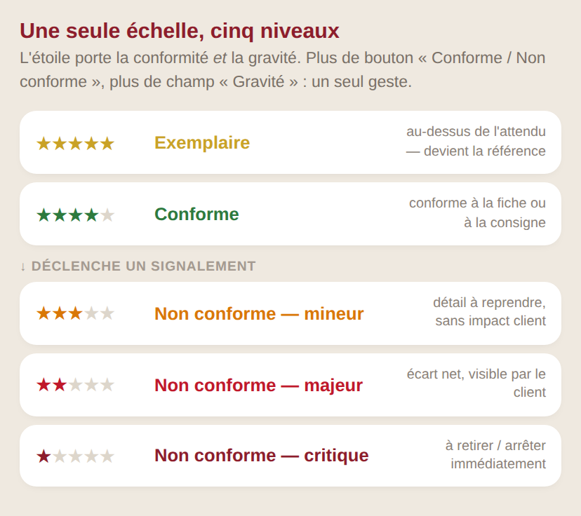
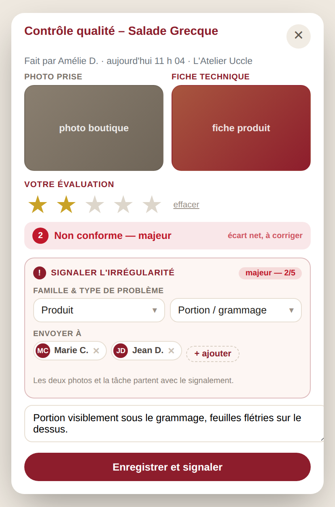

# Projet — une échelle unique, et la référence en face

**Le besoin, en deux morceaux.**

1. La note et la conformité ne font qu'un : **5 = exemplaire, 4 = conforme,
   3 / 2 / 1 = non conforme mineur / majeur / critique**. En dessous de 4,
   le consultant qualifie l'irrégularité et l'envoie.
2. Il faut toujours **quelque chose à comparer** : la fiche technique quand la
   tâche porte sur un produit, une **photo type** quand elle n'en porte pas.

> **État : proposition.** Aucun code applicatif modifié. Les maquettes sont
> rendues avec l'habillage **réel** de la modale
> (`_review_modal_style.twig`) — une maquette dessinée à part ment sur les
> proportions.

---

## 1. Une seule échelle



Le bouton *« Conforme / Non conforme »* **disparaît**, et le champ
*« Gravité »* aussi : l'étoile porte les deux. Un geste au lieu de trois, sur un
téléphone, debout dans une boutique.

**« Exemplaire »** plutôt qu'« excellent » ou « exceptionnel » : le mot dit
qu'il y a un modèle à montrer, pas seulement que c'était bien fait.

| ★ | Niveau | Ce que ça veut dire | Effet |
|---|---|---|---|
| 5 | **Exemplaire** | au-dessus de l'attendu | rien |
| 4 | **Conforme** | conforme à la fiche ou à la consigne | rien |
| 3 | **Non conforme — mineur** | détail à reprendre, sans impact client | signalement |
| 2 | **Non conforme — majeur** | écart net, visible par le client | signalement |
| 1 | **Non conforme — critique** | à retirer / arrêter immédiatement | signalement |

**Aucun changement d'API.** `rating` existe déjà dans le contrat d'avis, et
`is_accepted` se déduit : `rating >= 4 → 1`, `rating <= 3 → 0`. Le seuil vit en
paramètre (`review_conforme_min`, défaut 4), pas dans le code.

---

## 2. Un produit : la fiche technique en face



C'est ce qui est **déjà construit et déployé** : `product_id` sur la tâche →
`GET /products` → la colonne « Fiche technique ». Elle reste éteinte tant que
T13 et T14 ne sont pas livrés côté API (voir `API_ASKS.md`).

Sous 4, le bloc bordeaux apparaît. Il ne demande plus la gravité — elle est
déjà dans l'étoile, rappelée en pastille (« majeur — 2/5 ») :

| Champ | Forme |
|---|---|
| **Famille** | Produit · Service · Propreté · Matériel · Hygiène & sécurité · Autre |
| **Type de problème** | liste **filtrée par la famille** — « Cuisson » n'a de sens que sous Produit |
| **Envoyer à** | les consultants de la boutique, pré-remplis et retirables |

Les deux photos partent avec le signalement : le consultant n'a rien à joindre.

---

## 3. Une tâche sans produit : la photo type

*« Mise en place vitrine du matin »* ne porte aucun produit — donc aucune fiche
technique. La colonne de droite affiche alors la **photo type de la tâche** :
ce à quoi ça doit ressembler. Même mise en page que l'écran du §2, seule la
légende change — « Photo type · tâche » au lieu de « Fiche technique ».

La photo est **déposée sur la tâche par l'Owner**, une fois. Une seule active
par tâche ; l'ancienne est conservée, datée et signée — « qui a décidé que
c'était ça, et quand » est une question qui se pose six mois plus tard.

Cette moitié **ne dépend d'aucun endpoint** : elle vit entièrement dans le
panel et peut partir sans attendre le backend, contrairement à la fiche
produit.

---

## 4. Où le signalement arrive


Un écran `/irregularites` avec un badge dans la navigation. Tri par gravité —
c'est-à-dire par étoile — puis par date. Trois états : **Nouveau → Vu →
Traité**.

---

## 5. Ce que ça touche dans le code

| Fichier | Ce qui change |
|---|---|
| `src/app/Views/checklist/_review_modal.twig` | le bandeau de niveau, le bloc `.dn-irr` ; **suppression** de `.dn-acc` |
| `src/app/Views/checklist/_review_modal_style.twig` | ≈ 55 lignes, vocabulaire existant |
| `src/app/Views/checklist/_review_modal_script.twig` | le niveau pilote l'affichage ; la colonne de droite bascule fiche technique / photo type |
| `src/app/Views/checklist/_review_submit.twig` | `window.tfbReview` porte la famille, le type, les destinataires |
| `src/app/Http/Controllers/Checklist/ChecklistController.php` | `submitReview()` dérive `is_accepted` et écrit l'irrégularité sous le seuil |
| `src/app/Services/Product/ProductPhotoService.php` | rend la fiche produit **ou**, à défaut de `product_id`, la photo type de la tâche |
| `src/app/Views/checklist/review_stack.twig` | **écran séparé, carte propre** — à traiter aussi, sinon il perd tout en silence |

Le signalement part dans **le même POST** que l'avis. En 4G, un avis enregistré
et un signalement perdu est le pire des deux mondes.

---

## 6. Ce qui vit en base, pas dans le code

**`mac_irregularity_type`** — le référentiel, auto-provisionné :
`id · famille · libelle · ordre · actif`. Ajouter « Allergènes » sous Hygiène se
fait par une ligne, pas par un déploiement.

**`mac_irregularity`** — les signalements. **Pas de colonne `gravite`** : elle
serait la copie de `rating`, et deux sources pour un même fait finissent par
diverger.

```
id · id_shop · id_task · id_checklist · completion_id · review_date
id_type · rating · commentaire · attachment_id · product_id
id_auteur · auteur_nom · destinataires · statut
created_at · seen_at · closed_at · id_closed_by
```

**`mac_task_reference_photo`** — la photo type :
`id · id_task · attachment_id · actif · id_auteur · created_at`.
L'historique reste ; une seule ligne active par tâche.

Les **destinataires** viennent de `user_membership` / `user_profile`, que
`ConsultantUserRepository` lit déjà. Pas de second annuaire.

---

## 7. Ce qui reste à trancher

Quatre points, avec ma recommandation.

1. **Le seuil de conformité est 4**, en paramètre. Si un jour 3 doit passer pour
   acceptable, c'est un réglage, pas un déploiement.
2. **Famille et type obligatoires** sous 4. Sans ça, six mois plus tard la
   moitié du fil est en « Autre » et rien n'est analysable.
3. **Qui dépose la photo type :** l'Owner seul. C'est une consigne réseau, pas
   une appréciation de tournée.
4. **L'envoi.** Le panel n'a **aucune infrastructure de mail** : ni SMTP, ni
   PHPMailer. La v1 est donc le fil + le badge. L'e-mail est un lot à part, à
   décider sur un chiffre — si les irrégularités restent « Nouveau » trois
   jours, il est justifié.

---

## 8. Chiffrage

| Lot | Contenu | Ordre de grandeur |
|---|---|---|
| 1 | L'échelle : bandeau, seuil paramétrable, `is_accepted` dérivé | ½ journée |
| 2 | Les trois tables + le référentiel dans `/system/params` | ½ journée |
| 3 | Le bloc irrégularité (3 partiels) + `review_stack.twig` | 1 journée |
| 4 | La photo type : dépôt et bascule de la colonne | ¾ journée |
| 5 | L'écran `/irregularites` + le badge | 1 journée |
| 6 | Bancs de test (seuil, filtrage du type, une seule requête) | ½ journée |

**≈ 4 jours**, sans l'e-mail.

La colonne « Fiche technique » reste éteinte tant que **T13** et **T14** ne sont
pas livrés côté API. La **photo type**, elle, ne dépend de personne : elle vit
entièrement dans le panel et peut partir tout de suite.
