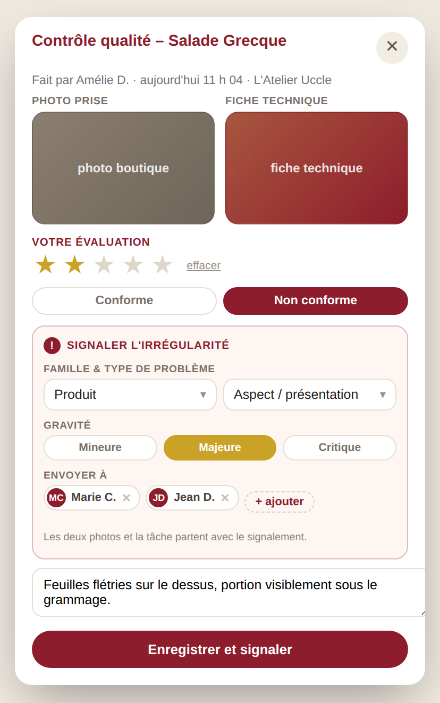
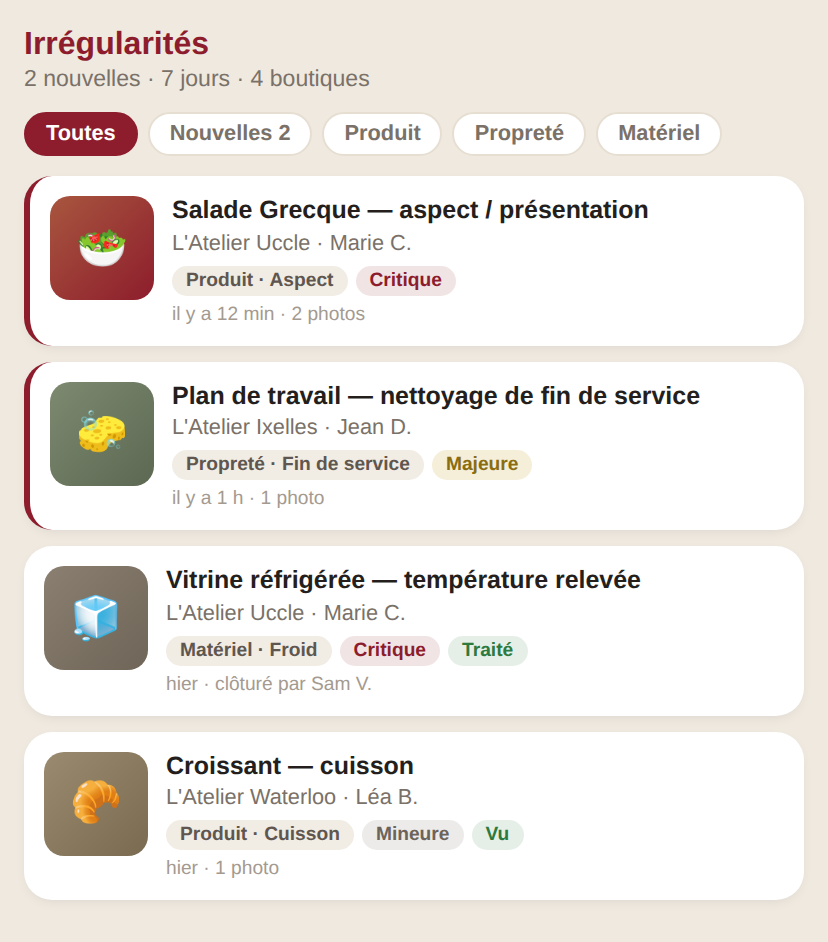

# Projet — signaler une irrégularité

**Le besoin.** Pendant la validation d'une tâche, quand le consultant coche
*« Non conforme »*, il doit pouvoir **qualifier** l'irrégularité — famille,
type de problème, gravité — et l'**envoyer** aux consultants concernés.

Aujourd'hui *« Non conforme »* ne produit qu'un `is_accepted = 0` et un
commentaire libre. C'est invisible : rien n'est classable, rien n'est comptable,
et personne n'est prévenu. Le refus meurt dans la ligne de la tâche.

> **État : proposition.** Rien de ce document n'est en production. Aucun code
> applicatif n'a été modifié — les deux écrans ci-dessous sont des maquettes
> rendues avec l'habillage **réel** de la modale (`_review_modal_style.twig`),
> pour que les proportions soient les vraies.

---

## 1. L'écran

### Dans la modale d'évaluation



Le bloc bordeaux **n'existe pas tant que « Conforme » est sélectionné**. Il
apparaît au clic sur *« Non conforme »* et le bouton du bas devient
*« Enregistrer et signaler »*.

Quatre champs, dans l'ordre où l'on pense :

| Champ | Forme | Pourquoi |
|---|---|---|
| **Famille** | liste | Produit · Service · Propreté · Matériel · Hygiène & sécurité · Autre |
| **Type de problème** | liste, **filtrée par la famille** | « Cuisson » n'a de sens que sous Produit |
| **Gravité** | 3 pastilles | Mineure / Majeure / Critique — c'est ce qui trie le fil |
| **Envoyer à** | pastilles pré-remplies, retirables | les consultants de la boutique, déjà là ; `+ ajouter` pour élargir |

Les deux photos déjà affichées — celle prise et la fiche technique — partent
avec le signalement. Le consultant n'a rien à joindre.

### Où ça arrive



Un écran `/irregularites`, avec un badge dans la navigation. Filtres par état et
par famille, tri par gravité puis par date. Trois états : **Nouveau → Vu →
Traité**.

---

## 2. Où ça se branche

Tout existe déjà ; le projet ajoute, il ne réécrit rien.

| Fichier | Ce qui change |
|---|---|
| `src/app/Views/checklist/_review_modal.twig` | le bloc `.dn-irr`, après `.dn-acc`, `hidden` par défaut |
| `src/app/Views/checklist/_review_modal_style.twig` | l'habillage du bloc (≈ 40 lignes, vocabulaire existant) |
| `src/app/Views/checklist/_review_modal_script.twig` | afficher/masquer sur `data-acc`, filtrer le type sur la famille |
| `src/app/Views/checklist/_review_submit.twig` | `window.tfbReview` porte les 4 champs en plus |
| `src/app/Http/Controllers/Checklist/ChecklistController.php` | `submitReview()` écrit l'irrégularité quand `is_accepted = 0` |
| `src/app/Views/checklist/review_stack.twig` | **écran séparé** — il a sa propre carte, à traiter aussi ou il perdra le bloc en silence |

Le signalement se pose dans **la même requête** que l'avis. Un consultant sur le
terrain, en 4G, ne doit pas voir son avis enregistré et son signalement perdu :
un seul POST, une seule transaction.

---

## 3. Ce qui n'est pas codé en dur

Les listes vivent en base, pas dans le Twig.

**`mac_irregularity_type`** — le référentiel, auto-provisionné comme les autres
(`CREATE TABLE IF NOT EXISTS` + miroir dans `database/`) :

```
id · famille · libelle · ordre · actif
```

Ajouter « Allergènes » sous Hygiène, ou retirer « Rupture », se fait par une
ligne — pas par un déploiement. L'écran `/system/params` sert déjà de modèle
d'administration.

**`mac_irregularity`** — les signalements :

```
id · id_shop · id_task · id_checklist · completion_id · review_date
id_type · gravite · commentaire · attachment_id · product_id
id_auteur · auteur_nom · destinataires · statut
created_at · seen_at · closed_at · id_closed_by
```

Les **destinataires** viennent de `user_membership` / `user_profile` — les
tables que `ConsultantUserRepository` lit déjà. Pas de liste de noms en dur, pas
de doublon d'annuaire.

---

## 4. « Envoyer aux consultants » — ce que ça veut dire exactement

**Il n'y a aucun envoi d'e-mail dans le panel aujourd'hui** : pas de SMTP, pas
de PHPMailer, rien. C'est le point à trancher, et il change le chiffrage.

| Option | Ce que ça donne | Coût |
|---|---|---|
| **A. Fil + badge dans le panel** *(recommandé pour la v1)* | le consultant voit le compteur en ouvrant l'app | aucun ajout d'infra |
| **B. A + e-mail** | il est prévenu sans ouvrir l'app | un service SMTP à configurer et un secret de plus au déploiement |
| **C. A + poussée vers la boutique** | la boutique voit son irrégularité dans **son** app | **dépend de l'API** — voir §6 |

Je recommande **A maintenant, B ensuite si le délai de réaction pose problème**.
Le fil se mesure : si les irrégularités restent « Nouveau » trois jours, l'e-mail
est justifié par un chiffre, pas par une intuition.

---

## 5. Ce que je propose de trancher ainsi

Cinq décisions, avec ma recommandation — dites-moi celles que vous changez.

1. **La famille et le type sont obligatoires** dès qu'on coche « Non conforme ».
   Sans ça, six mois plus tard, la moitié du fil est en « Autre » et rien n'est
   analysable.
2. **La gravité est facultative**, par défaut *Majeure*. Un champ obligatoire de
   plus, sur un téléphone, en boutique, se remplit au hasard.
3. **Les destinataires sont pré-remplis** avec les consultants de la boutique,
   et modifiables. Personne ne choisit correctement dans une liste vide.
4. **Un seul signalement par tâche et par jour**, mis à jour si on revient
   dessus — la même clé unique que `mac_task_review`.
5. **Qui clôture :** l'auteur ou l'Owner. Le consultant destinataire passe la
   ligne en « Vu », pas en « Traité » : voir n'est pas régler.

---

## 6. Ce que ça demanderait à l'API — **T15**, si l'on veut l'option C

Rien n'est bloquant pour la v1 : le fil vit entièrement côté panel.

Pour que l'irrégularité arrive **dans l'app de la boutique**, il faudrait :

```
POST /consultant/shops/{shopId}/irregularities
GET  /consultant/irregularity-types          # le référentiel, réseau-large
```

À poser dans `BACKEND_SPEC.md` seulement quand l'option C est décidée — un
ticket ouvert que personne n'a demandé encombre la liste et retarde les autres.

---

## 7. Chiffrage

| Lot | Contenu | Ordre de grandeur |
|---|---|---|
| 1 | Les deux tables + le référentiel + `/system/params` | ½ journée |
| 2 | Le bloc dans la modale (3 partiels) + `review_stack.twig` | 1 journée |
| 3 | L'écriture dans `submitReview()`, transaction commune | ½ journée |
| 4 | L'écran `/irregularites` + le badge | 1 journée |
| 5 | Bancs de test (référentiel, filtrage du type, une seule requête) | ½ journée |

**≈ 3,5 jours**, sans l'e-mail et sans l'option C.
