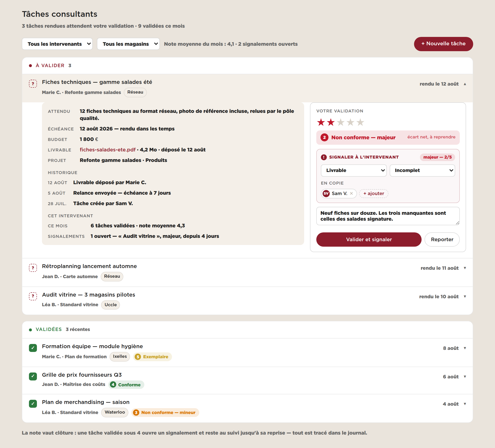
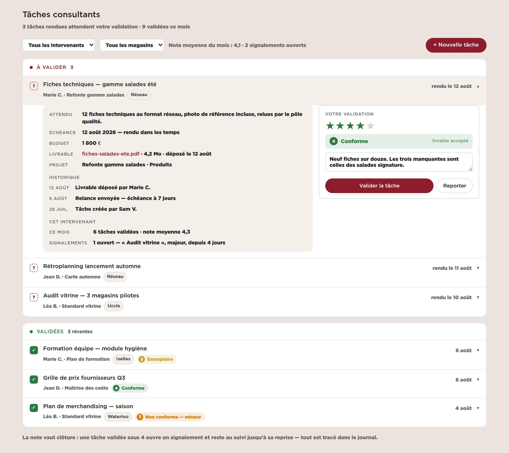

# Projet — la même mécanique de validation dans le back office CEO

**Le besoin.** Le panel consultant valide les tâches d'une boutique avec une
échelle à cinq niveaux (voir `PROJET_IRREGULARITE.md`). Le back office CEO
(`samsam2703MFC/consultant_BO`) valide les tâches **des consultants** — et il le
fait aujourd'hui avec **une case à cocher**.

Cocher inscrit `done_on` dans `ceo_project_task`, et rien d'autre. On sait que
le livrable est arrivé ; on ne sait pas s'il était bon. Un consultant qui rend
neuf fiches sur douze et un consultant qui rend les douze finissent au même
endroit, avec la même coche verte.

> **État : proposition.** Les maquettes sont rendues avec l'habillage **réel du
> BO** — `public/assets/ds/global.css` et `public/assets/css/app.css` du dépôt
> cloné, polices Gotham comprises. Aucun code modifié, et cette session est en
> lecture seule sur ce dépôt.

---

## 1. Sous 4, on signale



Le clic sur la ligne ouvre le dépli **qui existe déjà** dans l'écran Tâches
consultants : pas de nouvelle modale, pas de nouvel écran. Le dépli devient
simplement deux colonnes — le dossier à gauche, la validation à droite.

Même échelle que le panel, aux mêmes couleurs :

| ★ | Niveau | Effet |
|---|---|---|
| 5 | **Exemplaire** | clôture |
| 4 | **Conforme** | clôture |
| 3 | **Non conforme — mineur** | clôture **+ signalement** |
| 2 | **Non conforme — majeur** | clôture **+ signalement** |
| 1 | **Non conforme — critique** | clôture **+ signalement** |

**Le vocabulaire est partagé, le référentiel ne l'est pas.** Un « majeur » veut
dire la même chose dans les deux applications — sinon les chiffres ne
s'additionnent jamais. Mais ce qu'on reproche diffère : une tâche boutique rate
sur *Produit / Service / Propreté*, une tâche consultant sur *Livrable / Délai /
Qualité de service / Budget*. Deux référentiels, une seule échelle.

---

## 2. À partir de 4, un seul bouton



Le bloc bordeaux n'existe pas. Le bouton dit *« Valider la tâche »* au lieu de
*« Valider et signaler »*. C'est la seule différence : le geste courant reste
aussi court qu'une case à cocher — cinq étoiles au lieu d'un carré.

**La colonne de gauche porte de quoi décider**, et c'est le vrai gain sur la
case à cocher : l'attendu écrit à la création de la tâche, le livrable déposé,
l'historique des relances, et le passif de l'intervenant — sa moyenne du mois,
ses signalements ouverts. Valider sans ces lignes, c'est valider de mémoire.

---

## 3. Ce que ça change dans le BO

| Fichier | Ce qui change |
|---|---|
| `public/assets/js/templates.js` — `tplTaches` (l. 823) | le dépli passe à deux colonnes ; la case devient une pastille de niveau |
| `public/assets/js/app.js` | l'état de la ligne ouverte porte la note, la famille, le type, les destinataires |
| `src/writes.php` — `PATCH /projects/{id}/tasks/{taskId}` (l. 94) | accepte `note`, `famille`, `type`, `destinataires`, `commentaire` en plus de `done` |
| `src/endpoints.php` | l'écran Tâches renvoie la note, le niveau et le signalement ouvert |
| `sql/schema.sql` | deux colonnes sur `ceo_project_task`, une table de signalements |

**Une seule requête.** La note et le signalement partent dans le même `PATCH`
que la clôture : une tâche clôturée dont le signalement s'est perdu est pire que
les deux ensemble.

**Le journal existe déjà** (`ceo_journal_entry`) : une validation y écrit une
ligne, comme le budget et les projets. Rien à inventer pour la traçabilité.

---

## 4. Le modèle

Sur `ceo_project_task`, deux colonnes — pas plus :

```sql
ALTER TABLE ceo_project_task ADD COLUMN note TINYINT NULL;        -- 1..5
ALTER TABLE ceo_project_task ADD COLUMN validated_by VARCHAR(80) NULL;
```

`done_on` reste : c'est la date de clôture. `note` est nulle tant que la tâche
n'est pas validée — c'est ce qui alimente le groupe « À valider ».

Et une table de signalements, calquée sur celle du panel :

```
ceo_task_issue
  id · task_id · note · famille · type · commentaire
  destinataires · statut · created_at · created_by · closed_at
```

**Pas de colonne `gravite`** : elle serait la copie de `note`. Deux sources pour
un même fait finissent par diverger — même règle que côté panel.

Le référentiel famille/type vit dans `ceo_app_setting` ou dans sa propre table
de référence, comme `ceo_project_famille`. Pas dans le JavaScript.

---

## 5. Ce qui reste à trancher

1. **Qui valide.** Le CEO seul, ou aussi le responsable du projet ? Je
   recommande **le créateur de la tâche ou le CEO** — celui qui a écrit
   l'attendu est le mieux placé pour dire s'il est atteint.
2. **Une tâche validée sous 4 se rouvre-t-elle ?** Je recommande **non** : elle
   est close, et le signalement vit sa vie séparément jusqu'à sa reprise. Sinon
   une tâche traîne des semaines et fausse tous les délais.
3. **Le seuil est 4**, réglable dans `ceo_app_setting` — comme le paramètre
   équivalent côté panel.
4. **La relance existante** (`POST /tasks/{id}/reminder`) envoie déjà un e-mail.
   **Le BO a donc l'infrastructure de mail que le panel n'a pas** : le
   signalement peut partir par e-mail dès la v1, sans rien ajouter.

Ce dernier point est le seul écart réel entre les deux applications, et il joue
en faveur du BO.

---

## 6. Chiffrage

| Lot | Contenu | Ordre de grandeur |
|---|---|---|
| 1 | Les deux colonnes + la table de signalements + le référentiel | ½ journée |
| 2 | Le dépli à deux colonnes dans `tplTaches` | 1 journée |
| 3 | Le `PATCH` étendu, le journal, l'e-mail de signalement | ¾ journée |
| 4 | Le groupe « À valider », les pastilles, la moyenne du mois | ½ journée |

**≈ 2,75 jours.** Moins que côté panel : il n'y a ici ni photo, ni comparaison,
ni écran mobile.

---

## 7. Une remarque sur les deux dépôts

Ces deux projets ne partagent aucun code — ni langage de gabarit, ni framework,
ni base. Ce qu'ils doivent partager est **la définition des niveaux** : cinq
libellés, cinq couleurs, un seuil.

Le tenir à deux endroits est le risque le plus probable de ce chantier : le jour
où « mineur » devient « à surveiller » d'un côté seulement, les deux tableaux de
bord cessent silencieusement de parler de la même chose. À défaut de code
commun, que ce soit **une ligne de paramètre dans chaque application, écrite
depuis la même source**, et non deux constantes recopiées à la main.
